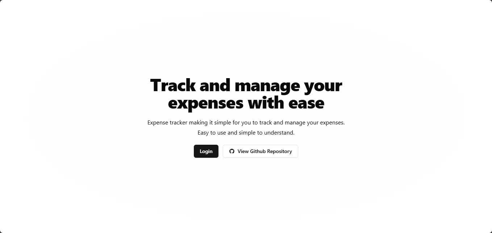

# Expense Tracker

Expense tracker making it simple for you to track and manage your expenses. Easy to use and simple to understand.

> This project is educational purpose only.



## Tech Stack

- Bun
- NextJS
- TailwindCSS
- HonoJS
- AuthJS
- Drizzle
- LibSQL
- ARCJet

## Features

- Authentication
- Add Expense
- Delete Expense

## Installation

1. Clone the repository

2. Install dependencies

   ```bash
   bun install
   ```

3. Run the project

   ```bash
   bun dev
   ```

4. Open [http://localhost:3000](http://localhost:3000) in your browser

5. Happy coding!
